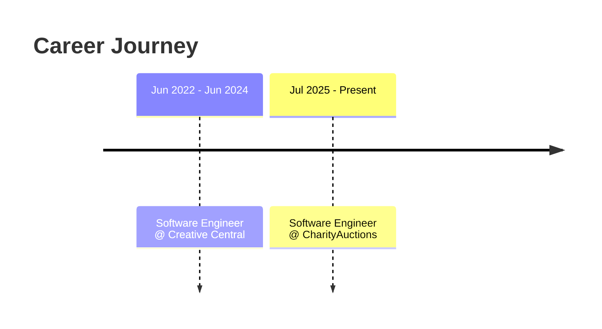

<!-- ═══════════════════════════════════════════════════════════════════════ -->
<!--                        MOHAMMAD ADIL SHAIK                                -->
<!--            Software Engineer · Full Stack · Backend · Cloud · AI          -->
<!--                     Tokyo Night · Premium Profile                         -->
<!-- ═══════════════════════════════════════════════════════════════════════ -->

<!-- ────────────  ANIMATED HEADER WAVE + BREATHING GLOW NAME  ──────────────── -->

<!-- Breathing / glowing animated name (SVG) -->

<!-- The glow/breathing effect is applied via the header capsule + this pulsing accent line -->

<!-- ─────────────────────────────  TYPING SVG  ───────────────────────────── -->

<!-- ─────────────────────────────  BADGES  ───────────────────────────────── -->

 

<!-- ─────────────────────────────  QUICK FACTS  ──────────────────────────── -->

  
  
  
  

 

<!-- ═══════════════════════════════════════════════════════════════════════ -->
<!--                              ABOUT ME                                     -->
<!-- ═══════════════════════════════════════════════════════════════════════ -->

##  &nbsp;About Me

> **Software Engineer with 3+ years of experience** building scalable full-stack
> and backend applications across the complete SDLC.

- 🧩 Proven track record designing **RESTful APIs, microservices, and cloud-deployed systems** in **Java, Spring, Python, Node.js, React, and AWS**.
- 🧠 Strong in **data structures, algorithms, OOP, and system design**.
- ⚙️ Experienced in **Agile/Scrum, CI/CD, unit & integration testing, code reviews**, and cross-functional collaboration.
- 🎓 **MS in Computer Science, GPA 4.0/4.0** — UNC Charlotte *(Graduated May 2026)*.
- 🚀 Focused on delivering **high-quality, maintainable software** in fast-paced environments.

 

<!-- ═══════════════════════════════════════════════════════════════════════ -->
<!--                            CURRENT FOCUS                                  -->
<!-- ═══════════════════════════════════════════════════════════════════════ -->

##  &nbsp;Current Focus

<!-- Flagship highlight banner -->

<table>
<tr>
<td width="50%" valign="top">

**🔭 Building**
- 🌐 **Auction 2.0** — scaling a production platform toward **100K+ users**
- ⚙️ Scalable **RESTful APIs & microservices** in Java, Node.js, Python
- 🤖 **AI-assisted workflows** and intelligent item categorization

</td>
<td width="50%" valign="top">

**🌱 Sharpening**
- 🧠 **System design** & distributed-systems patterns
- 🕸️ **Graph-based data structures** & caching (Redis)
- ☁️ **Cloud-native** delivery on **AWS & Azure**

</td>
</tr>
</table>

<!-- ═══════════════════════════════════════════════════════════════════════ -->
<!--                        PROFESSIONAL EXPERIENCE                            -->
<!-- ═══════════════════════════════════════════════════════════════════════ -->

##  &nbsp;Professional Experience

<table>
<tr>
<td align="center" width="120" valign="top">

 

**🟣**
**\`NOW\`**

</td>
<td valign="top">

### Software Engineer &nbsp;
**📍 Chicago, IL (Remote)** &nbsp;·&nbsp; \`Jul 2025 – Present\`

- 🚀 Built and shipped production features for the **Auction 2.0** platform using **React.js, Next.js, Node.js, and Python**; applied graph-based data structures and caching (Redis) — **↑ 35% customer engagement** & **↓ 40% API response time**.
- 🧱 Designed scalable **RESTful APIs and microservices** in Java, Node.js & Python using OOP and distributed-system principles to support **10,000+ users**; debugged production bidding flows via systematic algorithmic analysis.
- 🤝 Collaborated in **Agile/Scrum** sprints; automated nonprofit onboarding and integrated **AI-assisted item categorization** — **↓ 30% manual ops effort**.
- ✅ Maintained **85%+ test coverage** via unit/integration/regression testing on **CI/CD (GitHub Actions)**; led code reviews & authored technical docs.

</td>
</tr>
</table>

<table>
<tr>
<td align="center" width="120" valign="top">

 

**🟪**
**\`2022–24\`**

</td>
<td valign="top">

### Software Engineer &nbsp;
**📍 Remote** &nbsp;·&nbsp; \`Jun 2022 – Jun 2024\`

- 🧩 Built full-stack apps with **React.js, Angular, Node.js, Express.js, Flask & Django**; designed & optimized RESTful APIs in Python & PHP with dynamic programming and caching — **scaled to 15,000+ users**.
- 🗄️ Integrated **PostgreSQL, MySQL & MongoDB**; containerized microservices with **Docker**; deployed on **AWS & Azure**; built **CI/CD (GitHub Actions, Jenkins)** reaching **80%+ coverage** & **↓ 45% defects**.
- 🎨 Crafted responsive UI in **React.js, Angular, HTML5, CSS3, Bootstrap & Tailwind**; used **TypeScript** for type safety; applied OOP & system-design principles.

</td>
</tr>
</table>

<!-- ═══════════════════════════════════════════════════════════════════════ -->
<!--                              TECH STACK                                   -->
<!-- ═══════════════════════════════════════════════════════════════════════ -->

##  &nbsp;Tech Stack

**🧠 Languages**

**🎨 Frontend**

**⚙️ Backend & APIs**

**☁️ Cloud & DevOps**

**🗄️ Databases & Caching**

**🤖 AI & ML**

<!-- ═══════════════════════════════════════════════════════════════════════ -->
<!--                          GITHUB STATISTICS                                -->
<!-- ═══════════════════════════════════════════════════════════════════════ -->

##  &nbsp;GitHub Statistics

<!-- ═══════════════════════════════════════════════════════════════════════ -->
<!--                          CONTRIBUTION SNAKE                               -->
<!-- ═══════════════════════════════════════════════════════════════════════ -->

##  &nbsp;Contribution Snake

<picture>
  <source media="(prefers-color-scheme: dark)" srcset="https://raw.githubusercontent.com/mohammad-adil-shaik/mohammad-adil-shaik/output/github-snake-dark.svg" />
  <source media="(prefers-color-scheme: light)" srcset="https://raw.githubusercontent.com/mohammad-adil-shaik/mohammad-adil-shaik/output/github-snake.svg" />
  
</picture>

<!-- ═══════════════════════════════════════════════════════════════════════ -->
<!--                          FEATURED PROJECTS                                -->
<!-- ═══════════════════════════════════════════════════════════════════════ -->

##  &nbsp;Featured Projects

<!-- ── Project 1 ── -->
<table>
<tr>
<td width="60" align="center" valign="middle"><h1>⚡</h1></td>
<td valign="top">

### DevPulse — Real-Time Developer Productivity Dashboard
Full-stack SaaS dashboard aggregating **GitHub, Jira & CI/CD** metrics via **event-driven microservices** (Kafka, Node.js, GraphQL, Redis), deployed on **AWS** with **Docker & Kubernetes**.

\`📉 Sprint reporting: hours → 2 min\` &nbsp; \`🔁 −60% context-switching\` &nbsp; \`👥 500+ users\`

</td>
</tr>
</table>

<!-- ── Project 2 ── -->
<table>
<tr>
<td width="60" align="center" valign="middle"><h1>🤖</h1></td>
<td valign="top">

### SnapRecruit — AI-Powered Resume & Job Matching Platform
Full-stack platform (React.js, Django, PostgreSQL, AWS Lambda) delivering **AI-driven match scores**. Integrated **OpenAI API** with a **PyTorch transformer** for semantic similarity; applied **A\*** & dynamic programming for ranked recommendations.

\`🎯 91% match relevance\` &nbsp; \`👥 1,200+ beta users\`

</td>
</tr>
</table>

<!-- ── Project 3 ── -->
<table>
<tr>
<td width="60" align="center" valign="middle"><h1>🧬</h1></td>
<td valign="top">

### GVHMR — Generative Video Human Mesh Recovery
**AI/ML pipeline** in Python & PyTorch integrating **deep learning, computer vision & transformer models** for video-to-3D human mesh reconstruction. Containerized with Docker; deployed on **AWS EC2**.

\`📐 87% pose accuracy\` &nbsp; \`⚡ 3× throughput vs baseline\`

</td>
</tr>
</table>

<!-- ═══════════════════════════════════════════════════════════════════════ -->
<!--                              EDUCATION                                    -->
<!-- ═══════════════════════════════════════════════════════════════════════ -->

##  &nbsp;Education

<table>
<tr>
<td width="50%" align="center" valign="top">

### 🎓 UNC Charlotte
**Master of Science · Computer Science**

📍 Charlotte, NC &nbsp; · &nbsp; 🗓️ Graduated **May 2026**

</td>
<td width="50%" align="center" valign="top">

### 🎓 G. Pulla Reddy Engineering College
**Bachelor of Technology · Computer Science** *(JNTU)*

📍 Kurnool, India &nbsp; · &nbsp; 🗓️ **May 2024**

</td>
</tr>
</table>

<!-- ═══════════════════════════════════════════════════════════════════════ -->
<!--                            CERTIFICATIONS                                 -->
<!-- ═══════════════════════════════════════════════════════════════════════ -->

##  &nbsp;Certifications

<table>
<tr>
<td width="33%" align="center" valign="top">

 
**AWS Certified** Solutions Architect 

</td>
<td width="33%" align="center" valign="top">

 
**AWS Machine Learning** Foundations 

</td>
<td width="33%" align="center" valign="top">

 
**Microsoft Azure** Fundamentals 

</td>
</tr>
</table>

<!-- ═══════════════════════════════════════════════════════════════════════ -->
<!--                              LEADERSHIP                                   -->
<!-- ═══════════════════════════════════════════════════════════════════════ -->

##  &nbsp;Leadership

<table>
<tr>
<td width="60" align="center" valign="middle"><h1>👨‍🏫</h1></td>
<td valign="top">

### Graduate Teaching Assistant &nbsp;
**AI & Software Systems** &nbsp;·&nbsp; \`Aug 2025 – May 2026\`

Mentored **75+ graduate students** in AI algorithms (A\*, minimax, BFS/DFS, DP), system design, SDLC & Agile; ran code reviews and evaluated capstones across **two graduate-level courses**.

</td>
</tr>
</table>

<table>
<tr>
<td width="60" align="center" valign="middle"><h1>🎤</h1></td>
<td valign="top">

### Event Organizer &nbsp;
\`Jun 2022 – Dec 2023\`

Led cross-functional coordination for a **700+ attendee event** across **10+ stakeholder groups**.

</td>
</tr>
</table>

<!-- ═══════════════════════════════════════════════════════════════════════ -->
<!--                             ACHIEVEMENTS                                  -->
<!-- ═══════════════════════════════════════════════════════════════════════ -->

##  &nbsp;Achievements

| 🎯 Impact | 📊 Metric |
|:---|:---:|
| Customer engagement improvement (Auction 2.0) | **+35%** |
| API response-time reduction | **−40%** |
| Manual operations effort reduced via AI automation | **−30%** |
| Test coverage maintained (CI/CD) | **85%+** |
| Defect reduction via automated testing | **−45%** |
| Users supported across systems | **25,000+** |
| Graduate students mentored | **75+** |
| Sprint reporting time reduced (DevPulse) | **hours → 2 min** |
| AI job-match relevance (SnapRecruit) | **91%** |
| Pose-estimation accuracy (GVHMR) | **87%** |

<!-- ═══════════════════════════════════════════════════════════════════════ -->
<!--                            LET'S CONNECT                                  -->
<!-- ═══════════════════════════════════════════════════════════════════════ -->

##  &nbsp;Let's Connect

 

<!-- ═══════════════════════════════════════════════════════════════════════ -->
<!--                          PROFESSIONAL QUOTE                               -->
<!-- ═══════════════════════════════════════════════════════════════════════ -->

> ### 💬 *"Great engineering isn't about writing more code —*
> ### *it's about building scalable, maintainable systems that create real impact."*

 

<!-- ═══════════════════════════════════════════════════════════════════════ -->
<!--                    ANIMATED FOOTER (BREATHING GLOW)                       -->
<!-- ═══════════════════════════════════════════════════════════════════════ -->

⭐ From <a href="https://github.com/mohammad-adil-shaik">Mohammad Adil Shaik</a> — designed like a landing page, engineered like production.

