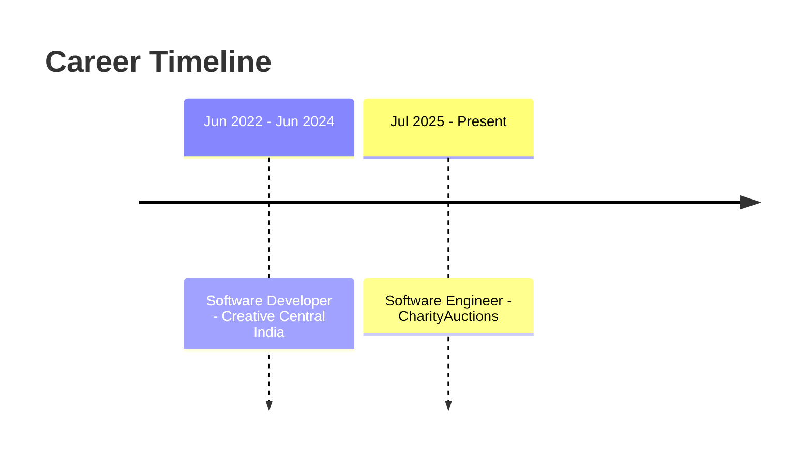

<!-- ═══════════════════════════════════════════════════════════════════════ -->
<!--                        MOHAMMAD ADIL SHAIK                                -->
<!--            Software Engineer · Full Stack · Backend · Cloud · AI          -->
<!--                     Tokyo Night · Premium Profile                         -->
<!-- ═══════════════════════════════════════════════════════════════════════ -->

<!-- ─────────────────────────────  HEADER  ───────────────────────────────── -->
<a href="https://adilshaik.in">
  
</a>

<!-- ─────────────────────────────  TYPING SVG  ───────────────────────────── -->
<div align="center">

[](https://git.io/typing-svg)

</div>

<!-- ─────────────────────────────  BADGES  ───────────────────────────────── -->
<div align="center">


<a href="https://github.com/mohammad-adil-shaik?tab=followers">
  
</a>
<a href="https://www.linkedin.com/in/mohammadadilshaik/">
  
</a>
<a href="https://adilshaik.in">
  
</a>

</div>

<br/>

<!-- ─────────────────────────────  QUICK FACTS  ──────────────────────────── -->
<div align="center">

  
  
  
  

</div>

<br/>

<!-- ═══════════════════════════════════════════════════════════════════════ -->
<!--                              ABOUT ME                                     -->
<!-- ═══════════════════════════════════════════════════════════════════════ -->

##  &nbsp;About Me


> **Software Engineer with 3+ years of experience** building scalable full-stack
> and backend applications across the complete SDLC.

- 🧩 Proven track record designing **RESTful APIs, microservices, and cloud-deployed systems** in **Java, Python, Node.js, React, and AWS**.
- 🧠 Strong in **data structures, algorithms, OOP, and system design**.
- ⚙️ Experienced in **Agile/Scrum, CI/CD, unit & integration testing, code reviews**, and cross-functional collaboration.
- 🎓 Pursuing **MS in Computer Science, GPA 4.0/4.0**, UNC Charlotte *(May 2026)*.
- 🚀 Focused on delivering **high-quality, maintainable software** in fast-paced environments.

<br clear="right"/>

<!-- ═══════════════════════════════════════════════════════════════════════ -->
<!--                            CURRENT FOCUS                                  -->
<!-- ═══════════════════════════════════════════════════════════════════════ -->

##  &nbsp;Current Focus

<table>
<tr>
<td width="50%" valign="top">

**🔭 Building**
- Production features for the **Auction 2.0** platform
- Scalable **RESTful APIs & microservices** in Java, Node.js, Python
- **AI-assisted workflows** and item categorization

</td>
<td width="50%" valign="top">

**🌱 Sharpening**
- **System design** & distributed systems patterns
- **Graph-based data structures** & caching (Redis)
- **Cloud-native** delivery on **AWS & Azure**

</td>
</tr>
</table>

<!-- ═══════════════════════════════════════════════════════════════════════ -->
<!--                        PROFESSIONAL EXPERIENCE                            -->
<!-- ═══════════════════════════════════════════════════════════════════════ -->

##  &nbsp;Professional Experience



### 🟣 Software Engineer &nbsp;·&nbsp; \`CharityAuctions\`
**📍 Chicago, IL (Remote)** &nbsp;·&nbsp; \`Jul 2025 – Present\`

- 🚀 Built and shipped production features for the **Auction 2.0** platform using **React.js, Next.js, Node.js, and Python**; applied graph-based data structures and caching (Redis) to optimize auction workflows — **improved customer engagement by 35%** and **cut API response time by 40%**.
- 🧱 Designed and enhanced scalable **RESTful APIs and microservices** in Java, Node.js, and Python using OOP and distributed-system principles to support **10,000+ users**; debugged production issues across bidding flows via systematic algorithmic analysis.
- 🤝 Collaborated cross-functionally in **Agile/Scrum** sprints; automated nonprofit onboarding workflows and integrated **AI-assisted item categorization** — **reduced manual ops effort by 30%**.
- ✅ Maintained **85%+ test coverage** through unit, integration & regression testing via **CI/CD (GitHub Actions)**; conducted code reviews and authored technical documentation enforcing system design & OOP best practices.

### 🟪 Software Developer &nbsp;·&nbsp; \`Creative Central India\`
**📍 Bhimavaram, India** &nbsp;·&nbsp; \`Jun 2022 – Jun 2024\`

- 🧩 Built full-stack applications using **React.js, Angular, Node.js, Express.js, Flask, and Django**; designed and optimized RESTful APIs in Python & PHP applying dynamic programming and caching — **improved scalability for 15,000+ users**.
- 🗄️ Integrated **PostgreSQL, MySQL, and MongoDB**; containerized backend microservices with **Docker**; deployed on **AWS and Azure**; implemented **CI/CD (GitHub Actions, Jenkins)** achieving **80%+ automated test coverage** and **reducing defects by 45%**.
- 🎨 Designed responsive UI components using **React.js, Angular, HTML5, CSS3, Bootstrap, and Tailwind CSS**; used **TypeScript** for type-safe development; applied OOP & system design principles for maintainable architecture.

<!-- ═══════════════════════════════════════════════════════════════════════ -->
<!--                              TECH STACK                                   -->
<!-- ═══════════════════════════════════════════════════════════════════════ -->

##  &nbsp;Tech Stack

<div align="center">

**🧠 Languages**


**🎨 Frontend**


**⚙️ Backend & APIs**


**☁️ Cloud & DevOps**


**🗄️ Databases & Caching**


**🤖 AI & Practices**


</div>

<details>
<summary><b>📋 Full Stack — Text View (recruiter-friendly)</b></summary>

```yaml
Languages:        Python, Java, JavaScript (ES6+), TypeScript, PHP, C++, SQL
Frontend:         React.js, Next.js, Angular, HTML5, CSS3, Bootstrap, Tailwind CSS
Backend & APIs:   Node.js, Express.js, Django, Flask, RESTful APIs, GraphQL,
                  Microservices, Distributed Systems
Cloud & DevOps:   AWS (EC2, Lambda, RDS, S3), Microsoft Azure, Docker,
                  Kubernetes, CI/CD (GitHub Actions, Jenkins), Git
Databases:        PostgreSQL, MySQL, MongoDB, Redis
AI / ML:          PyTorch, OpenAI API, Deep Learning, Computer Vision, Transformers
Practices:        Full SDLC, Agile/Scrum, System Design, DS & Algorithms, OOP,
                  Unit Testing, Code Reviews, Technical Documentation
```

</details>

<!-- ═══════════════════════════════════════════════════════════════════════ -->
<!--                          GITHUB STATISTICS                                -->
<!-- ═══════════════════════════════════════════════════════════════════════ -->

##  &nbsp;GitHub Statistics

<div align="center">


<br/><br/>


<br/><br/>


<br/><br/>


</div>

<!-- ═══════════════════════════════════════════════════════════════════════ -->
<!--                          CONTRIBUTION SNAKE                               -->
<!-- ═══════════════════════════════════════════════════════════════════════ -->

##  &nbsp;Contribution Snake

<div align="center">

<picture>
  <source media="(prefers-color-scheme: dark)" srcset="https://raw.githubusercontent.com/mohammad-adil-shaik/mohammad-adil-shaik/output/github-snake-dark.svg" />
  <source media="(prefers-color-scheme: light)" srcset="https://raw.githubusercontent.com/mohammad-adil-shaik/mohammad-adil-shaik/output/github-snake.svg" />
  
</picture>

</div>

<!-- ═══════════════════════════════════════════════════════════════════════ -->
<!--                          FEATURED PROJECTS                                -->
<!-- ═══════════════════════════════════════════════════════════════════════ -->

##  &nbsp;Featured Projects

<table>
<tr>
<td width="50%" valign="top">

### ⚡ DevPulse
**Real-Time Developer Productivity Dashboard**

Full-stack SaaS dashboard aggregating **GitHub, Jira, and CI/CD** metrics through **event-driven microservices** (Kafka, Node.js, GraphQL, Redis), deployed on **AWS** with **Docker & Kubernetes** via GCP CI/CD.

\`Kafka\` · \`Node.js\` · \`GraphQL\` · \`Redis\` · \`AWS\` · \`Docker\` · \`K8s\`

> 📉 Cut sprint reporting from **hours → 2 minutes**
> 🔁 Reduced context-switching by **60%** for **500+ users**

</td>
<td width="50%" valign="top">

### 🤖 SnapRecruit
**AI-Powered Resume & Job Matching Platform**

Full-stack platform (React.js, Django, PostgreSQL, AWS Lambda) where users upload resumes and receive **AI-driven match scores**. Integrated **OpenAI API** with a **PyTorch transformer** for semantic similarity; applied **A\*** and dynamic programming for ranked recommendations.

\`React\` · \`Django\` · \`PostgreSQL\` · \`AWS Lambda\` · \`OpenAI\` · \`PyTorch\`

> 🎯 **91% match relevance** across **1,200+ beta users**

</td>
</tr>
<tr>
<td width="50%" valign="top">

### 🧬 GVHMR
**Generative Video Human Mesh Recovery**

**AI/ML pipeline** in Python & PyTorch integrating **deep learning, computer vision, and transformer-based models** for video-to-3D human mesh reconstruction. Applied dynamic programming & OOP; containerized with Docker and deployed on **AWS EC2**.

\`Python\` · \`PyTorch\` · \`Computer Vision\` · \`Transformers\` · \`Docker\` · \`AWS EC2\`

> 📐 **87% pose-estimation accuracy** with **3× throughput** over baseline

</td>
<td width="50%" valign="top">

### 🌐 Explore More
**adilshaik.in**

Visit my portfolio for detailed case studies, architecture diagrams, and live demos of everything above — presented as a full engineering showcase.

\`Portfolio\` · \`Case Studies\` · \`Architecture\`

> 🔗 [**adilshaik.in →**](https://adilshaik.in)

</td>
</tr>
</table>

<!-- ═══════════════════════════════════════════════════════════════════════ -->
<!--                              EDUCATION                                    -->
<!-- ═══════════════════════════════════════════════════════════════════════ -->

##  &nbsp;Education

<table>
<tr>
<td width="50%" valign="top">

**🎓 University of North Carolina at Charlotte**
Master of Science, Computer Science
\`GPA 4.0 / 4.0\` &nbsp;·&nbsp; 📍 Charlotte, NC &nbsp;·&nbsp; \`May 2026\`

</td>
<td width="50%" valign="top">

**🎓 G. Pulla Reddy Engineering College (JNTU)**
Bachelor of Technology, Computer Science
\`CGPA 8.05 / 10\` &nbsp;·&nbsp; 📍 Kurnool, India &nbsp;·&nbsp; \`May 2024\`

</td>
</tr>
</table>

<!-- ═══════════════════════════════════════════════════════════════════════ -->
<!--                            CERTIFICATIONS                                 -->
<!-- ═══════════════════════════════════════════════════════════════════════ -->

##  &nbsp;Certifications

<div align="center">


</div>

<!-- ═══════════════════════════════════════════════════════════════════════ -->
<!--                              LEADERSHIP                                   -->
<!-- ═══════════════════════════════════════════════════════════════════════ -->

##  &nbsp;Leadership

<table>
<tr>
<td width="50%" valign="top">

### 👨‍🏫 Graduate Teaching Assistant
**AI & Software Systems · UNC Charlotte**
\`Aug 2025 – May 2026\`

Mentored **75+ graduate students** in AI algorithms (A\*, minimax, BFS/DFS, dynamic programming), system design, SDLC, and Agile; conducted code reviews and evaluated capstone deliverables across **two graduate-level courses**.

</td>
<td width="50%" valign="top">

### 🎤 Event Organizer
**TEDxGPREC**
\`Jun 2022 – Dec 2023\`

Led cross-functional coordination for a **700+ attendee event** across **10+ stakeholder groups**.

</td>
</tr>
</table>

<!-- ═══════════════════════════════════════════════════════════════════════ -->
<!--                             ACHIEVEMENTS                                  -->
<!-- ═══════════════════════════════════════════════════════════════════════ -->

##  &nbsp;Achievements

<div align="center">

| 🎯 Impact | 📊 Metric |
|:---|:---:|
| Customer engagement improvement (Auction 2.0) | **+35%** |
| API response-time reduction | **−40%** |
| Manual operations effort reduced via AI automation | **−30%** |
| Test coverage maintained (CI/CD) | **85%+** |
| Defect reduction via automated testing | **−45%** |
| Users supported across systems | **25,000+** |
| Graduate students mentored | **75+** |
| Sprint reporting time reduced (DevPulse) | **hours → 2 min** |
| AI job-match relevance (SnapRecruit) | **91%** |
| Pose-estimation accuracy (GVHMR) | **87%** |

</div>

<!-- ═══════════════════════════════════════════════════════════════════════ -->
<!--                            LET'S CONNECT                                  -->
<!-- ═══════════════════════════════════════════════════════════════════════ -->

##  &nbsp;Let's Connect

<div align="center">

<a href="https://www.linkedin.com/in/mohammadadilshaik/">
  
</a>
<a href="https://adilshaik.in">
  
</a>
<a href="mailto:madilshaik13@gmail.com">
  
</a>
<a href="https://github.com/mohammad-adil-shaik">
  
</a>

</div>

<br/>

<!-- ═══════════════════════════════════════════════════════════════════════ -->
<!--                          PROFESSIONAL QUOTE                               -->
<!-- ═══════════════════════════════════════════════════════════════════════ -->

<div align="center">

> ### 💬 *"Great engineering isn't about writing more code —*
> ### *it's about building scalable, maintainable systems that create real impact."*

</div>

<br/>

<!-- ═══════════════════════════════════════════════════════════════════════ -->
<!--                            ANIMATED FOOTER                                -->
<!-- ═══════════════════════════════════════════════════════════════════════ -->


<div align="center">

<sub>⭐ From <a href="https://github.com/mohammad-adil-shaik">Mohammad Adil Shaik</a> — designed like a landing page, engineered like production.</sub>

</div>
